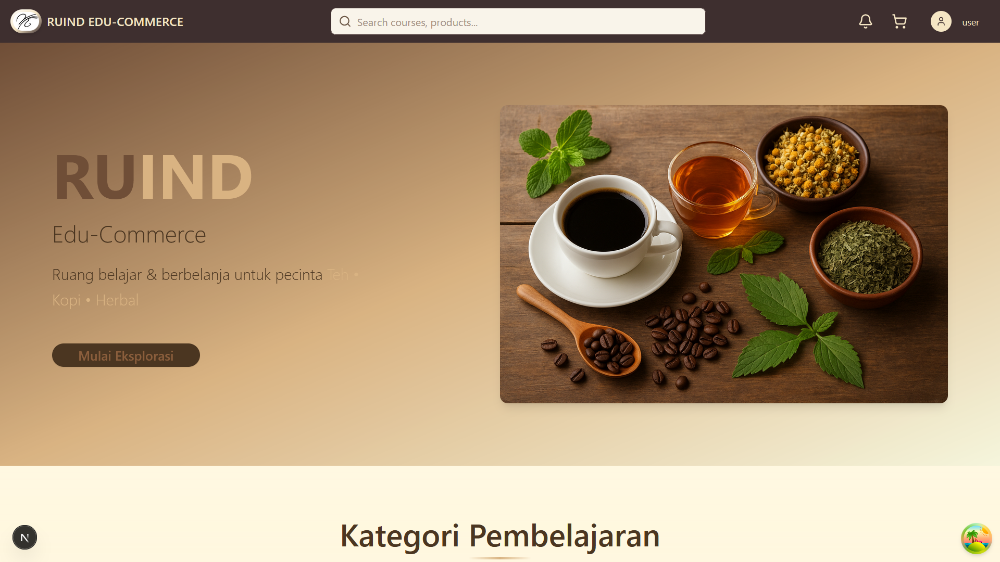
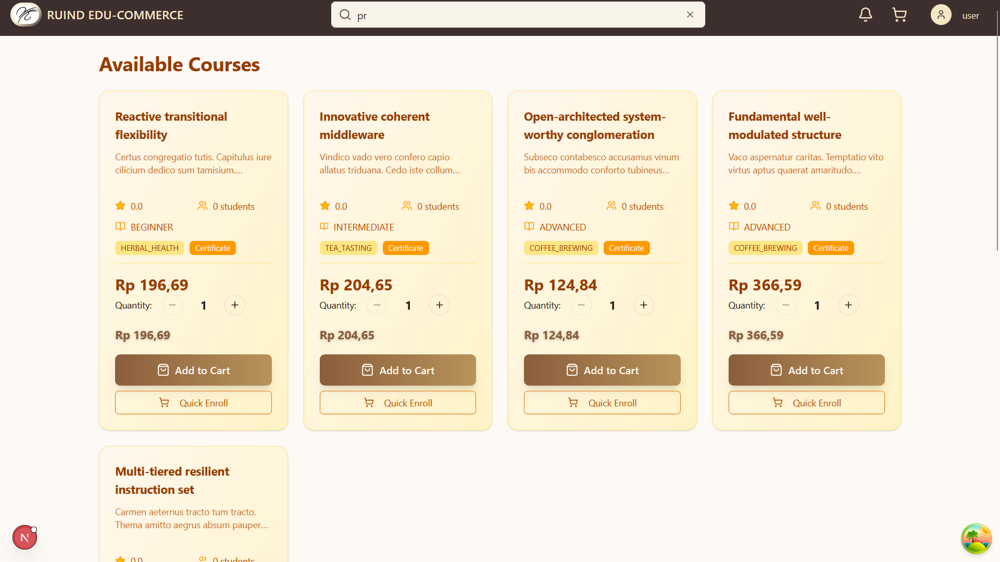
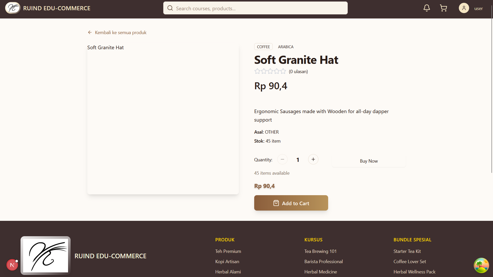
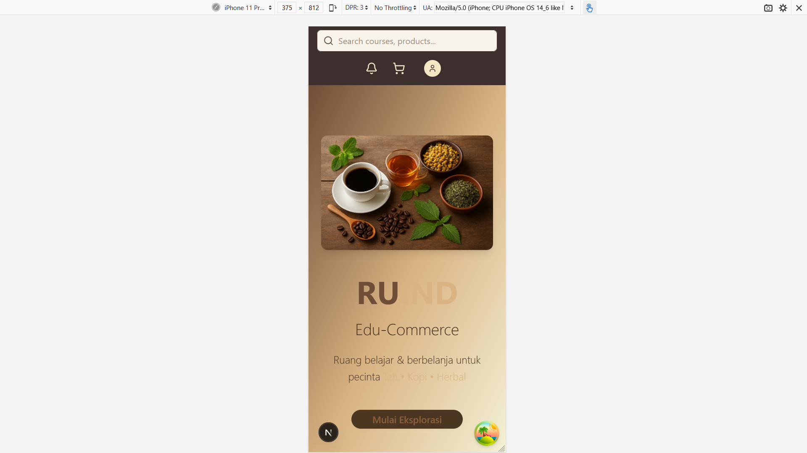
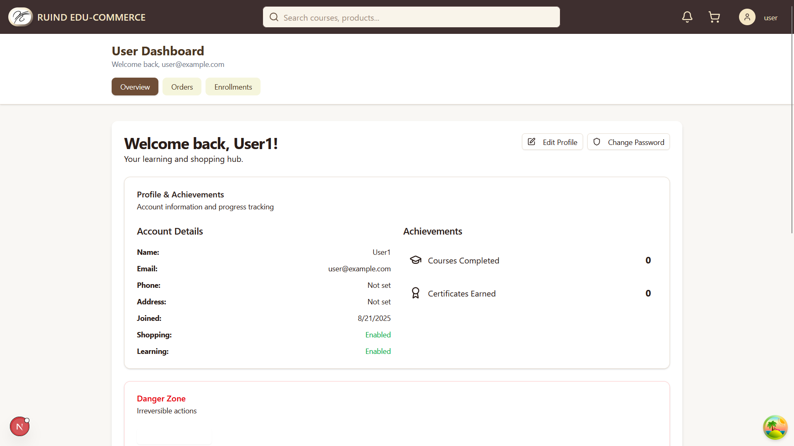
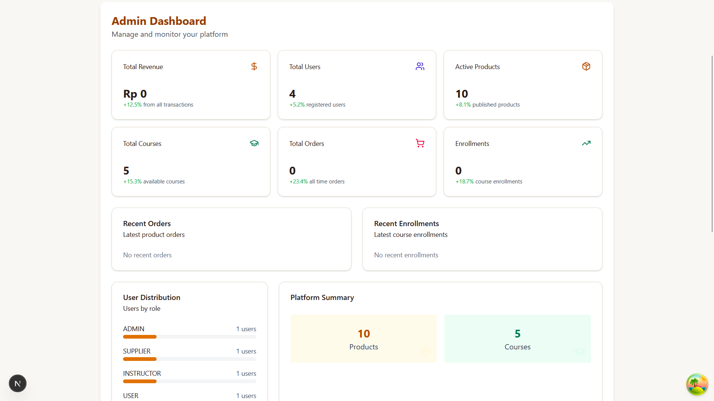

# ☕ RUIND EDU-COMMERCE

**Integrated Coffee, Tea & Herbal Learning and Commerce Platform** - Where baristas, entrepreneurs, and coffee enthusiasts learn while shopping for premium products.

## 🌟 Demo
- **🚀 Live Demo:** [RUIND-EDU-COMMERCE]https://final-project-fe-rifkykurniawanp-3w739adr6.vercel.app/

# 📸 Screenshots

1.   
   *Homepage with hero section and featured products*

2.   
   *Course catalog with filtering and search functionality*

3.   
   *Product detail page with ratings and reviews*

4.   
   *Responsive mobile interface*

5.   
   *User profile page with order history and account settings*

6.   
   *Admin panel with analytics and product management*


## ✨ Key Features

### 🎓 **E-Learning Platform**
- Comprehensive courses on coffee, tea, and herbal products
- Interactive video learning modules
- Completion certificates
- Progress tracking system
- Rating and review system for courses

### 🛒 **E-Commerce Platform**
- Premium coffee, tea, and herbal product catalog
- Advanced filtering by category, price, and rating
- Integrated shopping cart experience
- Secure payment processing
- Real-time inventory management

### 👤 **User Management**
- Authentication powered by NextAuth
- Personal dashboard
- Order and learning history
- Progress tracking
- Wishlist and favorites

### 📊 **Admin Dashboard**
- Course and product management
- Analytics and reporting
- User administration
- Order management
- Content management system

## 🛠️ Tech Stack

### **Frontend**
- **Framework:** Next.js 15.3.4 with App Router
- **Language:** TypeScript
- **Styling:** Tailwind CSS 4.1.12
- **UI Components:** Radix UI + shadcn/ui
- **Icons:** Lucide React + Tabler Icons
- **State Management:** React Context + TanStack Query
- **Form Handling:** React Hook Form with Zod validation

### **Key Libraries**
- **Authentication:** NextAuth 4.24.11
- **Data Fetching:** TanStack React Query 5.85.5
- **UI Components:** Radix UI primitives
- **Charts & Analytics:** Recharts 3.0.2
- **Drag & Drop:** DnD Kit 6.3.1
- **Date Management:** date-fns 4.1.0
- **Notifications:** Sonner + React Toastify

## 📋 Prerequisites

- **Node.js:** 18.17.0 or higher
- **Package Manager:** npm, yarn, or pnpm
- **Browser:** Modern browsers (Chrome, Firefox, Safari)

## 🚀 Quick Start

### 1. **Clone Repository**
```bash
git clone https://github.com/yourusername/ruind-edu-commerce.git
cd ruind-edu-commerce
```

### 2. **Install Dependencies**
```bash
npm install
# or
yarn install
# or
pnpm install
```

### 3. **Environment Setup**
```bash
cp .env.example .env.local
```

Configure your `.env.local` file:
```env
# API Configuration
NEXT_PUBLIC_API_BASE_URL=http://localhost:3002
NEXT_PUBLIC_API_BASE_URL_PROD=https://your-api-url.com

# Authentication (NextAuth)
NEXTAUTH_URL=http://localhost:3000
NEXTAUTH_SECRET=your-secret-key-here

# Optional: Analytics, Payment Gateway, etc.
```

### 4. **Start Development Server**
```bash
npm run dev
```

Open [http://localhost:3000](http://localhost:3000) in your browser.

## 🌍 Environment Variables

| Variable | Description | Required | Default |
|----------|-------------|----------|---------|
| `NEXT_PUBLIC_API_BASE_URL` | Backend API URL for development | ✅ | - |
| `NEXT_PUBLIC_API_BASE_URL_PROD` | Backend API URL for production | ✅ | - |
| `NEXTAUTH_URL` | Application URL for NextAuth | ✅ | http://localhost:3000 |
| `NEXTAUTH_SECRET` | Secret key for NextAuth sessions | ✅ | - |

## 📱 Usage Guide

### **For Customers:**
1. **Browse Courses:** Explore available coffee/tea learning content
2. **Shop Products:** Purchase premium coffee, tea, and herbal products
3. **Learn:** Enroll in courses and earn certificates
4. **Track Progress:** Monitor learning journey and order history

### **For Admins:**
1. **Dashboard Access:** Navigate to `/dashboard` for admin panel
2. **Content Management:** Add/edit courses and products
3. **User Administration:** Manage users and permissions
4. **Analytics:** View sales statistics and engagement metrics

## 🏗️ Project Structure

```
src/
├── app/                    # Next.js App Router
│   ├── (course)/          # Course-related pages (route group)
│   ├── (product)/         # Product-related pages (route group)
│   ├── dashboard/         # Admin dashboard
│   ├── auth/              # Authentication pages
│   └── cart/              # Shopping cart functionality
├── components/            # Reusable React components
│   ├── ui/               # Base UI components (shadcn/ui)
│   ├── course/           # Course-specific components
│   ├── product/          # Product-specific components
│   ├── cart/             # Shopping cart components
│   └── admin/            # Admin dashboard components
├── context/              # React Context providers
│   ├── AuthContext.tsx   # Authentication state
│   └── CartContext.tsx   # Shopping cart state
├── hooks/                # Custom React hooks
│   ├── course/           # Course-related hooks
│   ├── dashboard/        # Dashboard hooks
│   └── useAuth.ts        # Authentication hook
├── lib/                  # Utilities and API integration
│   ├── API/              # API client functions
│   └── utils.ts          # Helper functions
└── types/                # TypeScript type definitions
    ├── course.ts         # Course-related types
    ├── product.ts        # Product-related types
    ├── auth.ts           # Authentication types
    └── enum.ts           # Shared enums
```

## 🔧 Available Scripts

```bash
npm run dev          # Start development server with Turbopack
npm run build        # Build for production
npm run start        # Start production server
npm run lint         # Run ESLint for code quality
```

## 🎯 Target Users

- **☕ Professional Baristas** - Enhance brewing skills and latte art techniques
- **🌱 Coffee/Tea Enthusiasts** - Learn about origins, processing, and cupping
- **💼 F&B Entrepreneurs** - Business management and supply chain courses
- **🏠 Home Brewing Enthusiasts** - Home brewing techniques and equipment selection

## 🚀 Deployment

### **Vercel (Recommended)**
```bash
npm i -g vercel
vercel --prod
```

### **Other Platforms**
```bash
npm run build
npm run start
```

**Supported Platforms:** Vercel, Netlify, Railway, AWS, Google Cloud

## 🔗 API Integration

This frontend integrates with a robust backend API providing:
- User authentication and authorization
- Course management and progress tracking
- Product catalog and inventory management
- Payment processing
- Order management and fulfillment

**Backend Repository:** [Link to backend repository]

## 🔐 Security Features

- **Authentication:** Secure login system with NextAuth
- **Authorization:** Role-based access control (Admin/User)
- **Data Validation:** Comprehensive Zod schema validation
- **API Security:** Token-based authentication
- **XSS Protection:** Built-in Next.js security features

## 📊 Performance Optimizations

- **SSR/SSG:** Optimized with Next.js App Router
- **Image Optimization:** Next.js Image component with lazy loading
- **Bundle Optimization:** Tree shaking and automatic code splitting
- **Data Caching:** TanStack Query for efficient data management
- **CDN Ready:** Optimized for modern deployment platforms

## 🤝 Contributing

We welcome contributions! Please follow these steps:

1. Fork the repository
2. Create a feature branch (`git checkout -b feature/AmazingFeature`)
3. Commit your changes (`git commit -m 'Add some AmazingFeature'`)
4. Push to the branch (`git push origin feature/AmazingFeature`)
5. Open a Pull Request

Please read [CONTRIBUTING.md](CONTRIBUTING.md) for detailed guidelines.

## 🐛 Troubleshooting

### **Common Issues:**

**API Connection Error**
```bash
# Ensure backend server is running and .env.local URLs are correct
npm run dev
```

**Build Errors**
```bash
# Clear Next.js cache and rebuild
rm -rf .next
npm run build
```

**Image Loading Issues**
```bash
# Verify next.config.js has correct remote image domains configured
```

**Authentication Issues**
```bash
# Check NEXTAUTH_SECRET and NEXTAUTH_URL in environment variables
```

## 📈 Roadmap

- [ ] Mobile app development
- [ ] Advanced analytics dashboard
- [ ] Multi-language support
- [ ] Payment gateway integration
- [ ] Advanced course features (quizzes, assignments)
- [ ] Social learning features

## 📄 License

This project is licensed under the [MIT License](LICENSE) - see the LICENSE file for details.

## 👥 Development Team

- **Frontend Developer:** Rifky Kurniawan Putra
- **Backend Developer:** Rifky Kurniawan Putra
- **UI/UX Designer:** Rifky Kurniawan Putra
- **Product Manager:** Rifky Kurniawan Putra

## 🙏 Acknowledgments

- [Next.js](https://nextjs.org/) - The React framework for production
- [shadcn/ui](https://ui.shadcn.com/) - Beautiful and accessible component library
- [Tailwind CSS](https://tailwindcss.com/) - Utility-first CSS framework
- [Railway](https://railway.app/) - Backend hosting platform
- Coffee and tea community for inspiration ☕🍃

## 📞 Support

- **📧 Email:** support@ruind-edu.com
- **💬 Discord:** [Community Discord Link]
- **🐛 Issues:** [GitHub Issues](https://github.com/yourusername/ruind-edu-commerce/issues)
- **📖 Documentation:** [Full Documentation Link]

---

**⭐ Star this repository** if you find it helpful for your learning journey!

**Built with ❤️ for the global coffee and tea community**