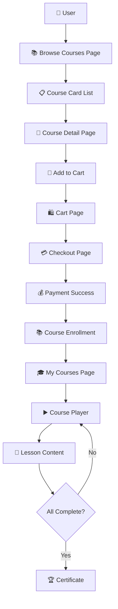

# 🎓 Course Flow Documentation - Frontend Blueprint

Complete user journey from course discovery to certificate completion.

---

## 🔄 User Journey Flow



### 📝 Step-by-Step Flow

```
1. 📚 Browse Courses (/courses)
   ├── Filter by category, level, price
   ├── Search courses by name/topic
   └── View course cards in grid/list

2. 📄 Course Detail (/courses/:slug)
   ├── Course overview & description
   ├── Modules & lessons breakdown
   ├── Instructor profile & reviews
   ├── Price & enrollment info
   └── "Add to Cart" button

3. 🛒 Shopping Cart (/cart)
   ├── List of courses & products
   ├── Remove unwanted items
   ├── Calculate total price
   └── "Checkout" button

4. 💳 Checkout & Payment (/checkout)
   ├── Order summary
   ├── Payment method selection
   ├── Submit payment
   └── Payment confirmation

5. 🎓 Learning Dashboard (/my-courses)
   ├── Enrolled courses list
   ├── Progress indicators
   ├── Certificate status
   └── "Continue Learning" links

6. ▶️ Course Player (/my-courses/:id)
   ├── Module navigation sidebar
   ├── Lesson content viewer
   ├── Progress tracking
   └── Mark lessons complete

7. 🏆 Certificate (/my-courses/:id/certificate)
   ├── Certificate preview
   └── Download/print options
```

---

## 📱 Frontend Pages & Components

### 🗂️ Pages Structure

| Page | Route | Key Components | Main Features |
|------|-------|----------------|---------------|
| **CoursesPage** | `/courses` | CourseCard, FilterSidebar | Browse, search, filter courses |
| **CourseDetailPage** | `/courses/:slug` | CourseInfo, ModuleList, AddToCartButton | Course details, curriculum, enroll |
| **CartPage** | `/cart` | CartItem, CartSummary | Manage cart, calculate total |
| **CheckoutPage** | `/checkout` | PaymentForm, OrderSummary | Process payment |
| **MyCoursesPage** | `/my-courses` | EnrolledCourseCard, ProgressBar | Dashboard of enrolled courses |
| **CoursePlayerPage** | `/my-courses/:id` | ModuleNavigation, LessonPlayer | Learning interface |
| **CertificatePage** | `/my-courses/:id/certificate` | CertificateViewer | View/download certificate |

### 🧩 Key Components

**Course Discovery**
- `CourseCard` - Display course info with thumbnail, title, price, rating
- `CourseGrid` - Grid layout for course cards
- `FilterSidebar` - Category, price, level filters
- `SearchBar` - Search courses by keywords

**Shopping & Payment**
- `AddToCartButton` - Add course to cart with loading states
- `CartItem` - Individual cart item (course or product)
- `CartSummary` - Total price calculation and checkout
- `PaymentForm` - Payment method selection and processing

**Learning Experience**
- `ModuleList` - Expandable list of course modules
- `LessonPlayer` - Video/article/quiz content renderer
- `ProgressTracker` - Visual progress indicators
- `LessonNavigation` - Next/previous lesson controls

**Completion & Certification**
- `CompletionBadge` - Show lesson/module completion status
- `CertificatePreview` - Display generated certificate
- `DownloadButton` - Certificate download functionality

---

## 🔗 API Integration

### 📡 Core API Services

```javascript
// Course Discovery
coursesApi.getAll(filters) → Course[]
coursesApi.getBySlug(slug) → CourseDetail
coursesApi.getCategories() → Category[]

// Shopping Cart
cartApi.addItem({itemType: 'COURSE', itemId, quantity}) → Cart
cartApi.getCart() → Cart
cartApi.removeItem(itemId) → Cart

// Payment Processing
paymentApi.checkout({cartId, paymentMethod}) → Payment
paymentApi.getPaymentStatus(paymentId) → PaymentStatus

// Learning Progress
enrollmentApi.getMyCourses() → Enrollment[]
enrollmentApi.getProgress(courseId) → Progress
enrollmentApi.updateProgress(lessonId) → Progress

// Certification
certificateApi.getCertificate(courseId) → Certificate
certificateApi.downloadCertificate(certificateId) → File
```

### 🔄 Data Flow

```
User Action → API Call → Update State → Re-render UI → User Feedback
```

**Example: Add to Cart**
```
Click "Add to Cart" 
  → cartApi.addItem() 
  → Update cart state 
  → Show success message 
  → Update cart icon badge
```

---

## ⚠️ Important Rules & Notes

### 📚 Course Structure
- Course → Modules → Lessons (hierarchical structure)
- Lesson types: `VIDEO`, `ARTICLE`, `QUIZ`, `ASSIGNMENT`
- Progress tracked per lesson individually

### 🛒 Shopping Cart
- Supports mixed items: courses + physical products  
- Must distinguish `itemType` in UI (show icons/labels)
- Calculate total across all item types
- Persist cart between sessions

### 🎓 Learning Progress
- Certificate only available when **100% complete**
- All lessons AND assignments must be finished
- Progress synced across devices
- Offline progress stored locally, synced when online

### 💳 Payment & Enrollment
- Payment success → automatic enrollment creation
- Failed payment → no enrollment, cart items remain
- Enrollment includes: `studentId`, `courseId`, `paymentId`, `enrolledAt`

### 🎯 User Experience
- Loading states for all async operations
- Error messages for failed actions  
- Success confirmations for completed actions
- Responsive design for mobile/desktop